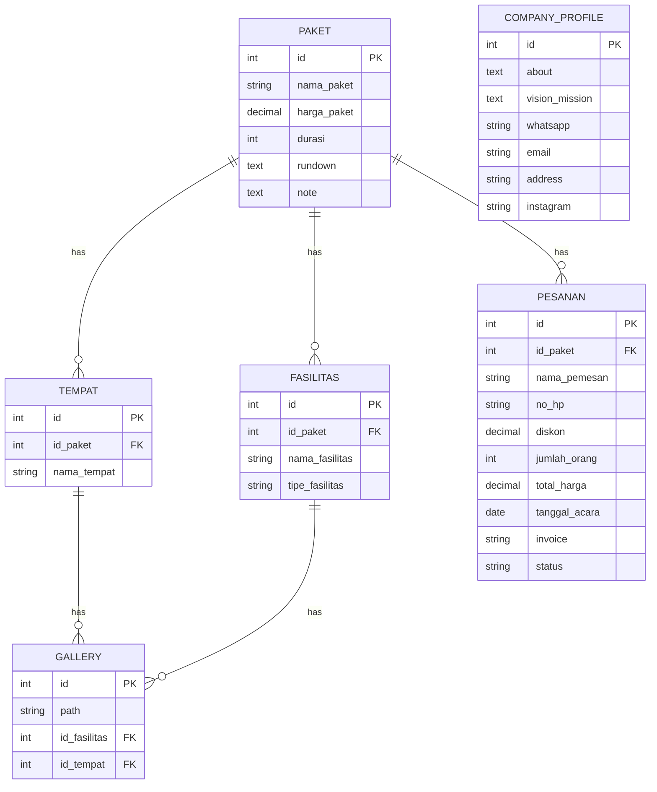

## API Endpoints Summary

### 1. Chatbot API (Customer Service with AI)

| Method | Endpoint | Description |
|--------|----------|-------------|
| GET | `/api/chatbot/menu` | Get initial greeting menu |
| POST | `/api/chatbot/message` | Send message to AI agent |
| POST | `/api/chatbot/search-pesanan` | Search order by phone number |
| GET | `/api/chatbot/pakets` | Get all tour packages via AI |
| GET | `/api/chatbot/company-profile` | Get company profile via AI |

#### Example: Send Message to AI Chatbot
```http
POST /api/chatbot/message
Content-Type: application/json

{
  "message": "Halo, saya ingin bertanya tentang paket tour"
}
```

**Response:**
```json
{
  "success": true,
  "response": "Halo! Selamat datang di Ghina Tour Travel! 😊\n\nSaya asisten virtual yang siap membantu Anda:\n\n📦 Paket Tour - Lihat daftar paket tour kami\n📋 Pesanan - Cek status pesanan Anda\n🏢 Profil Perusahaan - Info tentang kami"
}
```

---

### 2. Customer Web Routes

| Method | Endpoint | Description |
|--------|----------|-------------|
| GET | `/` | Home page |
| GET | `/packages` | List all packages |
| GET | `/packages/search?q=` | Search packages |
| GET | `/package/{id}` | Package detail page |
| GET | `/photos` | Gallery/photos page |

---

### 3. Admin API Routes (Resource Controllers)

#### Paket (Tour Package) Management
| Method | Endpoint | Description |
|--------|----------|-------------|
| GET | `/admin/paket` | List all packages |
| POST | `/admin/paket` | Create new package |
| GET | `/admin/paket/{id}` | Show package detail |
| GET | `/admin/paket/{id}/edit` | Edit package form |
| PUT/PATCH | `/admin/paket/{id}` | Update package |
| DELETE | `/admin/paket/{id}` | Delete package |

**Request Body (Create/Update):**
```json
{
  "nama_paket": "Paket Umroh Premium",
  "harga_paket": 25000000,
  "durasi": 9,
  "rundown": "Hari 1: Meeting Point...",
  "note": "Termasuk hotel",
  "tempats": [
    { "nama_tempat": "Mekkah" },
    { "nama_tempat": "Madinah" }
  ],
  "fasilitas": [
    { "nama_fasilitas": "Tiket Pesawat PP", "tipe_fasilitas": "transportasi" },
    { "nama_fasilitas": "Hotel Bintang 5", "tipe_fasilitas": "akomodasi" },
    { "nama_fasilitas": "Makan Siang", "tipe_fasilitas": "konsumsi" }
  ]
}
```

#### Pesanan (Order) Management
| Method | Endpoint | Description |
|--------|----------|-------------|
| GET | `/admin/pesanan` | List all orders |
| POST | `/admin/pesanan` | Create new order |
| GET | `/admin/pesanan/{id}` | Show order detail |
| GET | `/admin/pesanan/{id}/edit` | Edit order form |
| PUT/PATCH | `/admin/pesanan/{id}` | Update order |
| DELETE | `/admin/pesanan/{id}` | Delete order |

**Request Body (Create):**
```json
{
  "id_paket": 1,
  "nama_pemesan": "Ahmad Fauzi",
  "no_hp": "081234567890",
  "diskon": 10,
  "jumlah_orang": 4,
  "tanggal_acara": "2026-05-15"
}
```

#### Gallery Management
| Method | Endpoint | Description |
|--------|----------|-------------|
| GET | `/admin/gallery` | List all galleries |
| POST | `/admin/gallery` | Upload images |
| DELETE | `/admin/gallery/{id}` | Delete image |

**Request Body (Upload):**
```json
{
  "images": [file1.jpg, file2.png],
  "id_fasilitas": 1,
  "id_tempat": null
}
```

#### Company Profile Management
| Method | Endpoint | Description |
|--------|----------|-------------|
| GET | `/admin/company-profile` | View company profile |
| PUT | `/admin/company-profile` | Update company profile |

---

## Database Models & Relationships



---

## AI Agent Tools (RAG Implementation)

The chatbot uses an AI Agent with the following tools:

| Tool Name | Function |
|-----------|----------|
| `searchPaket($query)` | Search tour packages by name |
| `getPaketDetail($id)` | Get detailed package information |
| `searchPesanan($noHp)` | Search orders by phone number |
| `getCompanyProfile()` | Get company profile info |
| `getMenu()` | Get main menu options |

---